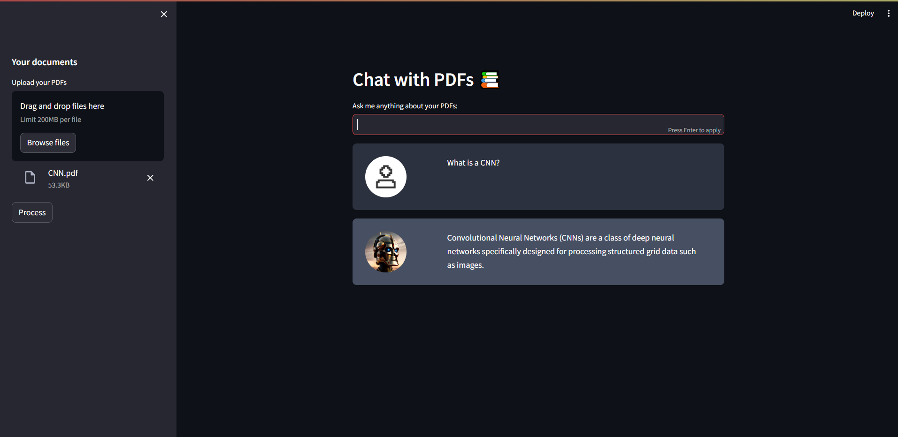

# Chat with PDFs

This repository contains a streamlit application that allows a user to chat with their PDF documents. The user can ask a question about the document's contents in natural language, and the application will provide a response based on the content. A language model is used to generate answers.

## Contents
- [Architecture](#architecture)
- [Requirements](#requirements)
- [Usage](#usage)
- [Note](#note)

## Architecture


The application follows these steps to provide responses to your questions:
- **Text Extraction**: Extracts text from the uploaded PDF documents.
- **Text Chunking**: The extracted text is divided into manageable chunks.
- **LLM**: The app uses a language model to generate vector representations - *embeddings* of the text chunks.
- **Semantic Matching**: When the user asks a question, the app compares it with the text chunks and identifies the semantically similar chunks.
- **Response**: The similar chunks are passed to the language model, which generates a response based on the content of the PDFs.

The model used in this project is google's [```flan-t5-xxl```](https://huggingface.co/google/flan-t5-xxl)

## Requirements
- langchain
- PyPDF2
- python-dotenv
- streamlit
- faiss-cpu
- altair
- tiktoken
- huggingface-hub
- InstructorEmbedding
- sentence-transformers
- torch
- torchvision
- setuptools

```bash
pip install langchain PyPDF2 python-dotenv streamlit faiss-cpu altair tiktoken huggingface-hub InstructorEmbedding sentence-transformers torch torchvision setuptools
```
Obtain an API Token from HuggingFace and add it to the .env file in your directory
```bash
HUGGINGFACEHUB_API_TOKEN = your_api_key
```
## Usage
- Install the required dependencies.
- Run `app.py` to start the streamlit application, using
```bash
streamlit run app.py
```

- Upload your PDF documents using the file uploader.
- Click the Process button to process the uploaded documents.
- Ask questions through the chat.



## Note
This project uses [*Instructor*](https://instructor-embedding.github.io/) to generate text embeddings and runs locally on your machine. The processing time will vary based on your hardware. 
